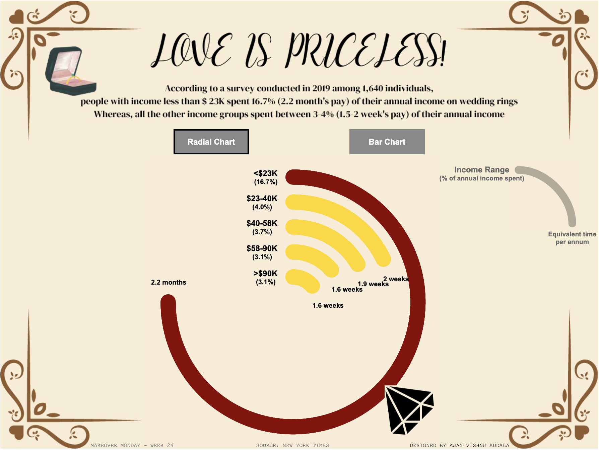

# Engagement Ring Spending Analysis Dashboard

This repository contains a Tableau dashboard that visualizes how much people spend on engagement rings based on their annual income. The dashboard is based on a dataset from a Morning Consult poll conducted for the New York Times Upshot in 2019.

## Dataset

The dataset provides information on the share of income spent on engagement rings across different income groups. Here's a summary of the data:

| Annual Income         | Share of Income Spent | Time      | Percentage |
|-----------------------|-----------------------|-----------|------------|
| Less than $23,000     | 2.2 months            | 9.5       | 16.70%     |
| $23,000 to $40,000    | 2 weeks               | 2         | 4.00%      |
| $40,000 to $58,000    | 1.9 weeks             | 1.9       | 3.70%      |
| $58,000 to $90,000    | 1.6 weeks             | 1.6       | 3.10%      |
| More than $90,000     | 1.6 weeks             | 1.6       | 3.10%      |

## Dashboard Features

- **Radial Bar Chart**: Highlights that people with an annual income of less than $23,000 spend almost 17% of their income, equivalent to 2.2 months' pay, on engagement rings.
- **Normal Bar Chart**: Provides a straightforward comparison of spending across different income groups.
- **Interactive Toggle**: Switch between the radial bar chart and normal bar chart views with a click of a button.

## Tableau Public Link

You can view the interactive dashboard on Tableau Public: [Love is Priceless!](https://public.tableau.com/views/LoveisPricelessMOM2024Week24/RadialChartDash?:language=en-US&:sid=&:display_count=n&:origin=viz_share_link)

## Snapshot of the Dashboard

## Files in this Repository

- Tableau workbook file.
- Original dataset used for the dashboard.
- Snapshot image of the dashboard.
- Demo video showcasing the dashboard's features.

## Conclusion

This dashboard provides insights into engagement ring spending habits across different income groups, illustrating significant differences in spending as a percentage of income. Feel free to explore and interact with the visualizations!

